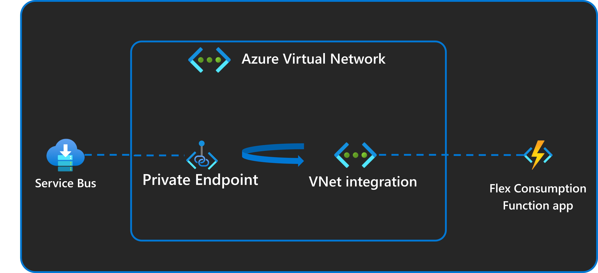
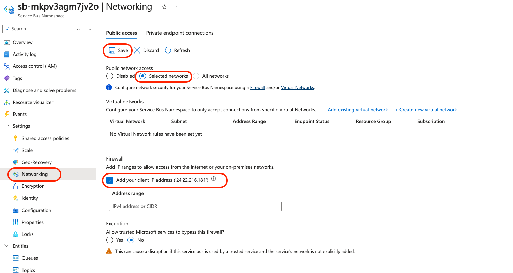

# Azure Functions .NET C# Service Bus Trigger using Azure Developer CLI

This template repository contains a Service Bus trigger reference sample for functions written in .NET C# and deployed to Azure using the Azure Developer CLI (`azd`). The sample uses managed identity and a virtual network to make sure deployment is secure by default. This sample demonstrates these two key features of the Flex Consumption plan:

* **High scale**. A low concurrency of 1 is configured for the function app in the `host.json` file. Once messages are loaded into Service Bus and the app is started, you can see how it scales to one app instance per message simultaneously.
* **Virtual network integration**. The Service Bus that this Flex Consumption app reads events from is secured behind a private endpoint. The function app can read events from it because it is configured with VNet integration. All connections to Service Bus and to the storage account associated with the Flex Consumption app also use managed identity connections instead of connection strings.



This project is designed to run on your local computer. You can also use GitHub Codespaces if available.

This sample processes queue-based events, demonstrating a common Azure Functions scenario where batch processing jobs are queued up with instructions for processing. The function app processes each message with a simulated delay to showcase the scaling capabilities.

> [!IMPORTANT]
> This sample creates several resources. Make sure to delete the resource group after testing to minimize charges!

## Prerequisites

+ [.NET 8 SDK](https://dotnet.microsoft.com/download/dotnet/8.0)
+ [Azure Functions Core Tools](https://learn.microsoft.com/azure/azure-functions/functions-run-local?tabs=v4%2Clinux%2Ccsharp%2Cportal%2Cbash#install-the-azure-functions-core-tools)
+ To use Visual Studio Code to run and debug locally:
  + [Visual Studio Code](https://code.visualstudio.com/)
  + [Azure Functions extension](https://marketplace.visualstudio.com/items?itemName=ms-azuretools.vscode-azurefunctions)
  + [C# extension](https://marketplace.visualstudio.com/items?itemName=ms-dotnettools.csharp)
+ [Azure CLI](https://learn.microsoft.com/cli/azure/install-azure-cli) (for deployment)
+ [Azure Developer CLI](https://learn.microsoft.com/azure/developer/azure-developer-cli/install-azd?tabs=winget-windows%2Cbrew-mac%2Cscript-linux&pivots=os-windows)
+ An Azure subscription with Microsoft.Web and Microsoft.App [registered resource providers](https://learn.microsoft.com/azure/azure-resource-manager/management/resource-providers-and-types#register-resource-provider)

## Initialize the local project

You can initialize a project from this `azd` template in one of these ways:

+ Use this `azd init` command from an empty local (root) folder:

    ```shell
    azd init --template functions-quickstart-dotnet-azd-service-bus
    ```

    Supply an environment name, such as `flexquickstart` when prompted. In `azd`, the environment is used to maintain a unique deployment context for your app.

+ Clone the GitHub template repository locally using the `git clone` command:

    ```shell
    git clone https://github.com/Azure-Samples/functions-quickstart-dotnet-azd-service-bus.git
    cd functions-quickstart-dotnet-azd-service-bus
    ```

    You can also clone the repository from your own fork in GitHub.

## Prepare your local environment

1. Navigate to the `src` app folder and create a file in that folder named `local.settings.json` that contains this JSON data:

    ```json
    {
        "IsEncrypted": false,
        "Values": {
            "AzureWebJobsStorage": "UseDevelopmentStorage=true",
            "FUNCTIONS_WORKER_RUNTIME": "dotnet-isolated",
            "ServiceBusConnection": "",
            "ServiceBusQueueName": "testqueue"
        }
    }
    ```

    > [!NOTE]
    > The `ServiceBusConnection` will be empty for local development. You'll need an actual Service Bus connection for full testing, which will be provided after deployment to Azure.

2. Navigate to the `src` folder and restore the .NET packages:

    ```shell
    cd src
    dotnet restore
    ```

## Run your app from the terminal

1. From the `src` folder, run this command to start the Functions host locally:

    ```shell
    func start
    ```

    > [!NOTE]
    > Since this function uses a Service Bus trigger, it will start but won't process messages until connected to an actual Service Bus queue. The function will be ready and waiting for messages.

2. The function will start and display the available functions. You should see output similar to:

    ```
    Functions:
        ServiceBusQueueTrigger: serviceBusQueueTrigger
    ```

3. To fully test the Service Bus functionality, you'll need to deploy to Azure first (see [Deploy to Azure](#deploy-to-azure) section) and then send messages through the Azure portal.

4. When you're done, press Ctrl+C in the terminal window to stop the `func` host process.

## Run your app using Visual Studio Code

1. Open the project root folder in Visual Studio Code.
2. Open the `src` folder in the terminal within VS Code.
3. Press **Run/Debug (F5)** to run in the debugger. 
4. The Azure Functions extension will automatically detect your function and start the local runtime.
5. The function will start and be ready to receive Service Bus messages (though local testing requires an actual Service Bus connection).

## Source Code

The Service Bus trigger function is defined in [`src/ServiceBusQueueTrigger.cs`](./src/ServiceBusQueueTrigger.cs). The function uses the `[ServiceBusTrigger]` attribute to define the trigger configuration.

This code shows the Service Bus queue trigger:

```csharp
using System;
using System.Threading.Tasks;
using Microsoft.Azure.Functions.Worker;
using Microsoft.Extensions.Logging;

namespace ServiceBusProcessor
{
    public class ServiceBusQueueTrigger
    {
        private readonly ILogger<ServiceBusQueueTrigger> _logger;

        public ServiceBusQueueTrigger(ILogger<ServiceBusQueueTrigger> logger)
        {
            _logger = logger;
        }

        [Function("ServiceBusQueueTrigger")]
        public async Task Run([ServiceBusTrigger("%ServiceBusQueueName%", Connection = "ServiceBusConnection")] 
            string messageBody, FunctionContext context)
        {
            _logger.LogInformation("C# ServiceBus Queue trigger start processing a message: {messageBody}", messageBody);
            
            // Simulate processing time with a 30-second delay to demonstrate scaling behavior
            await Task.Delay(TimeSpan.FromSeconds(30));
            
            _logger.LogInformation("C# ServiceBus Queue trigger end processing a message");
        }
    }
}
```

Key aspects of this code:

+ The `[ServiceBusTrigger]` attribute configures the function to trigger when messages arrive in the specified Service Bus queue
+ The queue name is read from the `ServiceBusQueueName` environment variable using the `%ServiceBusQueueName%` syntax
+ The connection string is read from the `ServiceBusConnection` setting
+ The function includes a 30-second `await Task.Delay(TimeSpan.FromSeconds(30))` delay to simulate message processing time and demonstrate the scaling behavior
+ Each message body is logged for debugging purposes using structured logging

The function configuration in [`src/host.json`](./src/host.json) sets `maxConcurrentCalls` to 1 for the Service Bus extension:

```json
{
  "extensions": {
    "serviceBus": {
        "maxConcurrentCalls": 1
    }
  }
}
```

This configuration ensures that each function instance processes only one message at a time, which triggers the Flex Consumption plan to scale out to multiple instances when multiple messages are queued.

## Deploy to Azure

Run this command to provision the function app, with any required Azure resources, and deploy your code:

```shell
azd up
```

You're prompted to supply these required deployment parameters:

| Parameter | Description |
| ---- | ---- |
| _Environment name_ | An environment that's used to maintain a unique deployment context for your app. You won't be prompted if you created the local project using `azd init`. |
| _Azure subscription_ | Subscription in which your resources are created. |
| _Azure location_ | Azure region in which to create the resource group that contains the new Azure resources. Only regions that currently support the Flex Consumption plan are shown. |

After deployment completes successfully, `azd` provides you with the URL endpoints and resource information for your new function app.

## Test the solution

1. Once deployment is complete, you can test the Service Bus trigger functionality:

2. **Configure Service Bus access**: You'll need to configure your client IP address in the Service Bus firewall to send test messages:
   

3. **Send test messages**: Use the Service Bus Explorer in the Azure Portal to send messages to the Service Bus queue. Follow [Use Service Bus Explorer to run data operations on Service Bus](https://learn.microsoft.com/en-us/azure/service-bus-messaging/explorer) to send messages and peek messages from the queue.
   

4. **Monitor scaling behavior**: 
   - Send 1,000 messages using the Service Bus Explorer
   - Open Application Insights live metrics and observe the number of instances ('servers online')
   - Notice your app scaling the number of instances to handle processing the messages
   - Given the purposeful 30-second delay in the app code, you should see messages being processed in 30-second intervals once the app's maximum instance count (default of 100) is reached
   

The sample telemetry should show that your messages are triggering the function and making their way from Service Bus through the VNet into the function app for processing.

## Redeploy your code

You can run the `azd up` command as many times as you need to both provision your Azure resources and deploy code updates to your function app.

> [!NOTE]
> Deployed code files are always overwritten by the latest deployment package.

## Clean up resources

When you're done working with your function app and related resources, you can use this command to delete the function app and its related resources from Azure and avoid incurring any further costs:

```shell
azd down
```

## Resources

For more information on Azure Functions, Service Bus, and VNet integration, see the following resources:

* [Azure Functions documentation](https://docs.microsoft.com/azure/azure-functions/)
* [Azure Service Bus documentation](https://docs.microsoft.com/azure/service-bus/)
* [Azure Virtual Network documentation](https://docs.microsoft.com/azure/virtual-network/)
